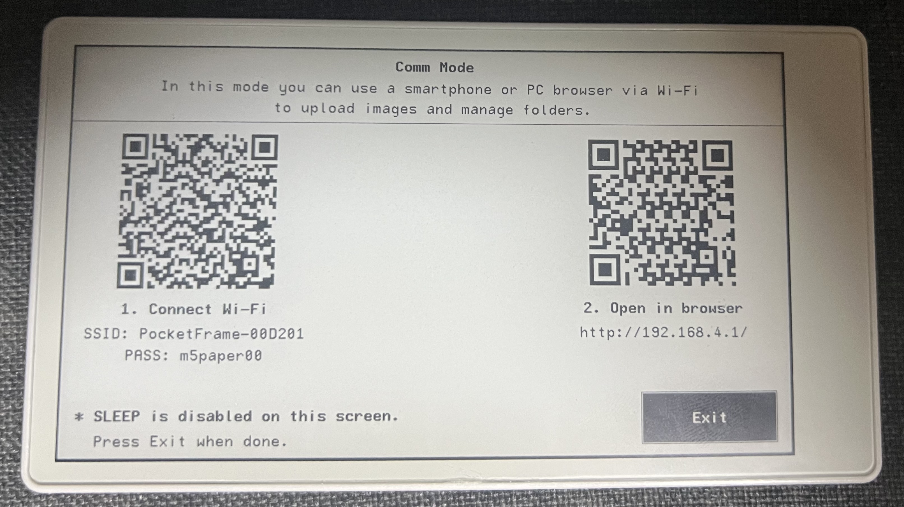
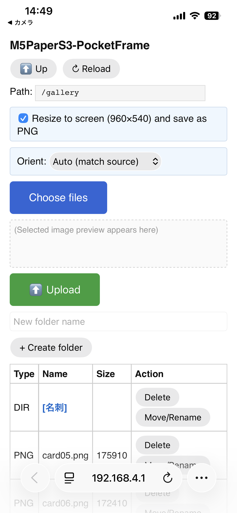
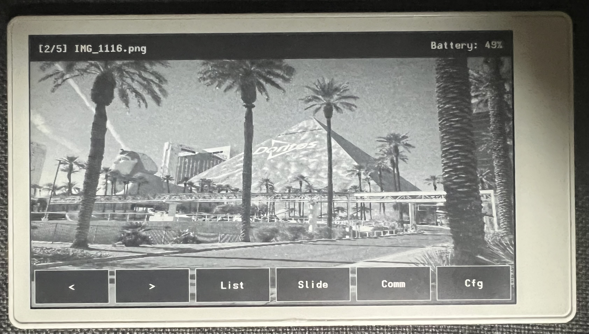
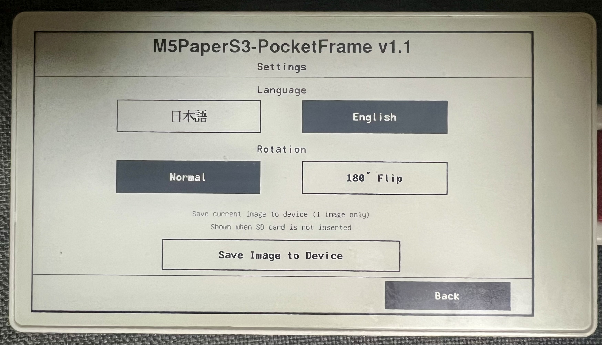

# M5PaperS3-PocketFrame

**[日本語版はこちら / Japanese](docs/README_ja.md)**

A portable digital photo frame for **M5PaperS3** (4.7" e-Paper 960×540, ESP32-S3).  
Easily transfer images via Wi-Fi from your smartphone!  
(microSD card required.)

<p align="center">
  
</p>

### Easy Install!!  
**[Web Installer](https://unyoooo.github.io/m5PaperS3-PocketFrame/installer/)**  
Flash directly from your browser with one click  
(Chrome / Edge desktop required)

---

## Highlights — Transfer Images from Your Smartphone

The standout feature of PocketFrame is **wireless image management from any smartphone or PC browser**.

1. Tap **Comm** in the menu — the device becomes a Wi-Fi access point
2. Scan the QR code with your phone to connect
3. Open the browser — upload, organize, and delete images instantly

You can also swap images via SD card on a PC, but using your smartphone is way easier.

<p align="center">
  
  <br><em>QR codes for Wi-Fi connection and browser URL</em>
</p>

<p align="center">
  
  <br><em>Web UI on smartphone — upload, create folders, manage files</em>
</p>

Images are **automatically resized to 960×540 and converted to PNG** on the phone before upload, so even large photos from your camera roll work perfectly.

---

## Features

### Touch Menu
Tap the screen to open the menu bar with file info and battery level.

<p align="center">
  
</p>

| Button | Function |
|--------|----------|
| `<` `>` | Previous / Next image |
| List | Browse folders and images on SD card |
| Slide | Slideshow with HH:MM:SS interval picker (max 24h) |
| Comm | Wi-Fi file manager (see above) |
| Cfg | Settings — language, rotation, save to device |

Tap outside the buttons to dismiss the menu.

### Settings

<p align="center">
  
</p>

| Setting | Description |
|---------|-------------|
| Language | Switch between 日本語 / English |
| Rotation | Normal or 180° flip (for upside-down mounting) |
| Save Image to Device | Save current image to flash (1 image only). Displayed when no SD card is inserted |

### Slideshow with Smart Power Saving
- **Under 60s interval**: Light Sleep — tap responsive, ~40x power saving
- **60s or more**: Deep Sleep — power button to stop, ~2000x power saving
- State preserved in RTC memory; automatically advances to next image

Not sure about all the details, but it does its best to save power.

### Power Management
- Auto Deep Sleep after 60s idle (shows "SLEEP" mark)
- CPU frequency scaling: 80MHz idle / 240MHz for image decode & Wi-Fi
- Last viewed image remembered across reboots (NVS persistent storage)
- On first boot, recursively finds the first image from SD root

### Internationalization
- Device UI and Web UI both support **Japanese / English**
- Language setting persists across power cycles

### Device Image Backup
- Save one image to the device's internal flash memory
- When no SD card is inserted, the saved image is displayed automatically
- Great as a default display or emergency backup

---

## Hardware

- **M5PaperS3** (ESP32-S3, 4.7" e-Paper 960×540, PSRAM)
- microSD card (FAT32, with JPG/PNG images)

---

## Build (for developers)

### Requirements
- [PlatformIO](https://platformio.org/)
- USB-C cable

### Build & Flash
```bash
./scripts/upload.sh
# or: pio run -t upload && pio device monitor
```

### Prepare Release (update Web Installer binaries)
```bash
./scripts/prepare-release.sh
```

---

## SD Card Structure

```
/
├── gallery/
│   ├── photo1.jpg
│   ├── photo2.png
│   └── vacation/
│       └── img001.jpg
└── other_folder/
    └── image.jpg
```

- Supports JPG / PNG anywhere on the SD card
- Uploading via Web UI automatically resizes to 960×540 PNG

---

## Technical Details

| Item | Detail |
|---|---|
| Platform | pioarduino (Arduino-ESP32 3.x) |
| Display | M5GFX (LovyanGFX), epd_quality / epd_fast |
| Image decode | PSRAM two-sprite pipeline + pushRotateZoomWithAA |
| Sleep | esp_light_sleep / M5.Power.deepSleep |
| State save | RTC_DATA_ATTR + NVS (Preferences) + LittleFS |
| Wi-Fi | WIFI_AP + WebServer (built-in) |
| CPU scaling | 80MHz idle / 240MHz decode & Wi-Fi |
| Flash usage | ~84% |
| RAM usage | ~16% |

---

## State Machine

```
VIEW ──tap──► MENU ──[<][>]──► VIEW (prev/next image)
                │    ──outside──► VIEW (close menu)
                ├── [List] ──► LIST ──tap──► VIEW (select image)
                │                    ──close──► VIEW (restore)
                ├── [Slide] ──► SS_PICK_FOLDER ──► SS_INTERVAL ──► SLIDESHOW
                │                                                    └──tap──► VIEW
                ├── [Comm] ──► COMM (Wi-Fi AP) ──exit──► VIEW
                └── [Cfg] ──► SETTINGS ──back──► VIEW
```

---

## Libraries

| Library | Author | License |
|---------|--------|---------|
| [M5Unified](https://github.com/m5stack/M5Unified) | M5Stack | MIT |
| [M5GFX](https://github.com/m5stack/M5GFX) (LovyanGFX) | M5Stack / lovyan03 | MIT |
| [pioarduino (Arduino-ESP32)](https://github.com/pioarduino/platform-espressif32) | pioarduino | Apache-2.0 |
| [ESP Web Tools](https://esphome.github.io/esp-web-tools/) | ESPHome | Apache-2.0 |

## License

MIT

## Version

- **v1.1** — Settings: 180° rotation, save image to device (LittleFS), SD-removal safety
- **v1.0** — Initial release
