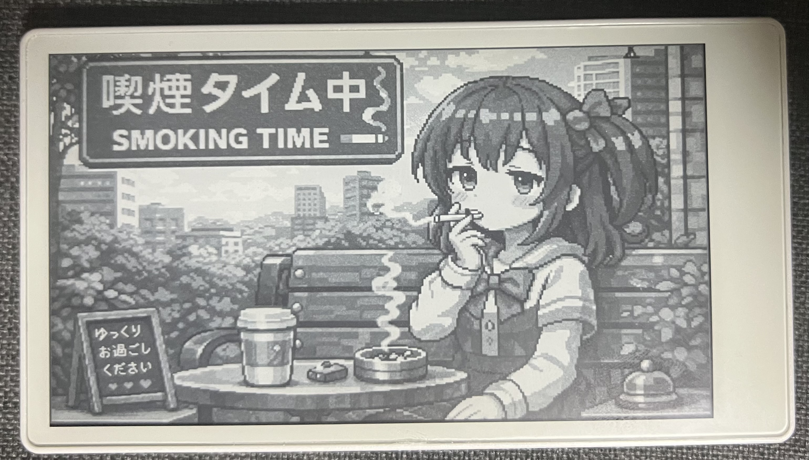
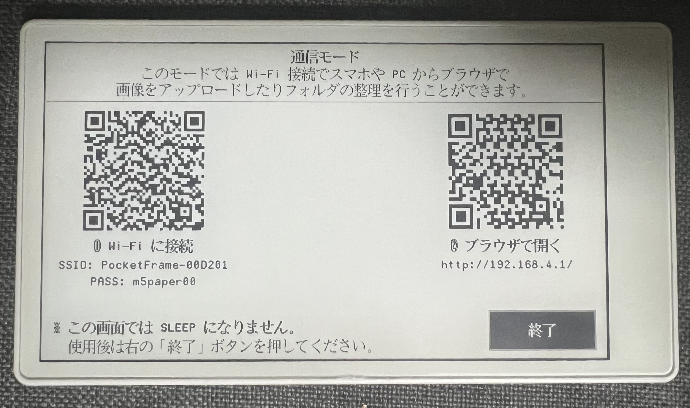
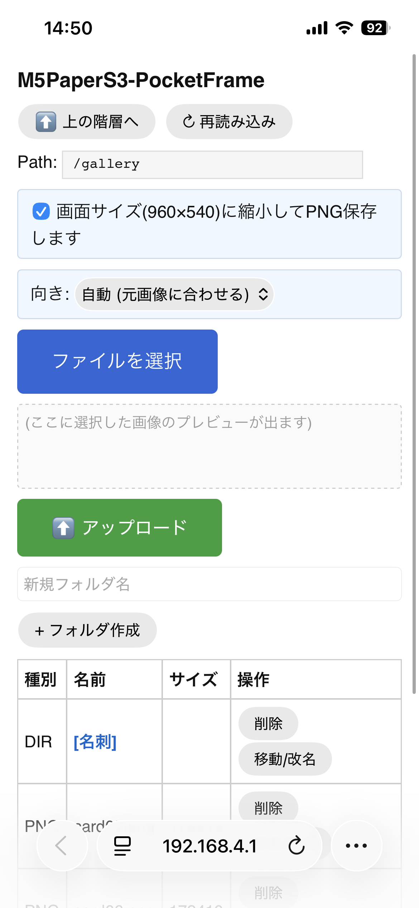
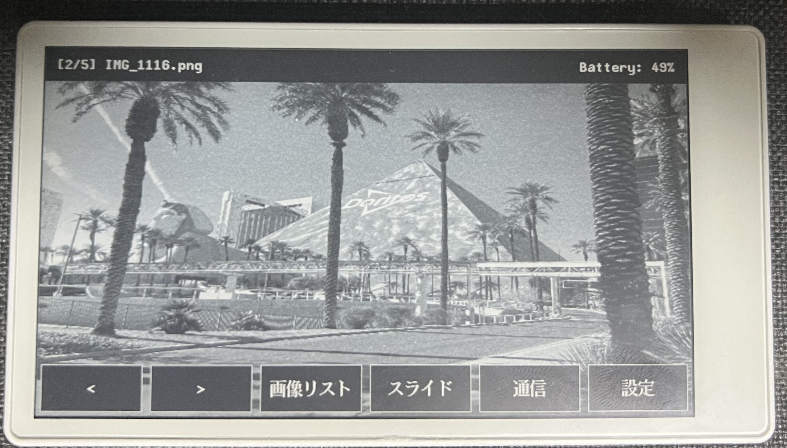
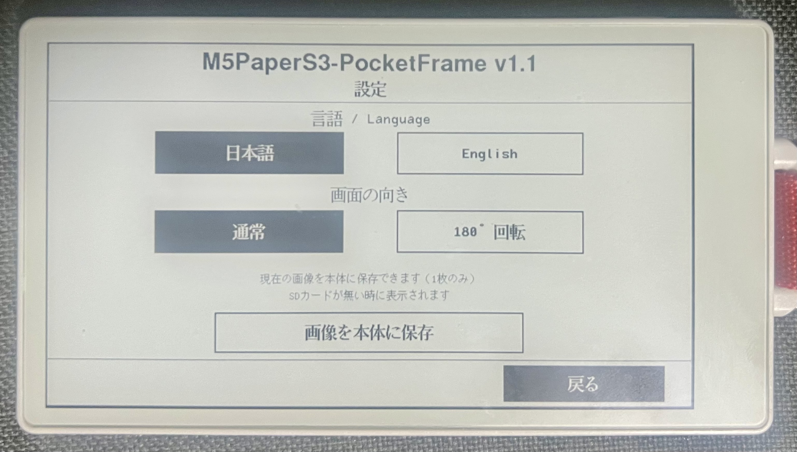

# M5PaperS3-PocketFrame

**[English version](../README.md)**

**M5PaperS3** (4.7" e-Paper 960×540, ESP32-S3) 向けのポータブルデジタルフォトフレームです。  
スマホからお手軽にWi-Fiで画像を転送！！  
（SDカードは必須なのです。）

<p align="center">
  
</p>

### かんたんインストール！！  
**[Web インストーラ](https://unyoooo.github.io/m5PaperS3-PocketFrame/installer/)**  
ブラウザからワンクリックで書き込み
（Chrome / Edge デスクトップ版が必要です）

---

## 最大の特徴 — スマホで画像転送

PocketFrame の一番の特徴は、**スマホや PC のブラウザから Wi-Fi で画像を管理できる**ことです。

1. メニューの **「通信」** をタップ — 本体が Wi-Fi アクセスポイントになります
2. 表示された QR コードをスマホで読み取って接続
3. ブラウザが開いたら — 画像のアップロード、フォルダ整理、削除がすぐにできます

PCでSDカードの画像入れ替えてもいいけど、スマホが楽ちん。

<p align="center">
  
  <br><em>Wi-Fi 接続用とブラウザ URL 用の QR コード</em>
</p>

<p align="center">
  
  <br><em>スマホの Web UI — アップロード、フォルダ作成、ファイル管理</em>
</p>

画像は**アップロード前にスマホ側で自動的に 960×540 にリサイズされ、PNG に変換**されます。カメラロールの大きな写真もそのまま使えます。

---

## 機能

### タッチメニュー
画面をタップするとメニューバーが表示されます。ファイル名とバッテリー残量も確認できます。

<p align="center">
  
</p>

| ボタン | 機能 |
|--------|------|
| `<` `>` | 前 / 次の画像 |
| 画像リスト | SD カード内のフォルダ・画像を閲覧 |
| スライド | スライドショー（HH:MM:SS で間隔指定、最大 24 時間） |
| 通信 | Wi-Fi ファイル管理（上記参照） |
| 設定 | 言語・回転・本体保存 |

ボタン以外の場所をタップするとメニューを閉じます。

### 設定画面

<p align="center">
  
</p>

| 設定項目 | 説明 |
|---------|------|
| 言語 | 日本語 / English の切替 |
| 画面の向き | 通常 / 180° 回転（逆さ設置用） |
| 画像を本体に保存 | 現在の画像を本体に保存（1枚のみ）。SDカードが無い時に表示されます |

### スライドショー & スマート省電力
- **60 秒未満の間隔**: Light Sleep — タップで即応答、省電力 約 40 倍
- **60 秒以上の間隔**: Deep Sleep — 電源ボタンで停止、省電力 約 2000 倍
- RTC メモリで状態を保持し、自動的に次の画像に進みます  

### 電源管理
- 60 秒無操作で自動 Deep Sleep（右上に "SLEEP" 表示）
- CPU 周波数スケーリング: 待機 80MHz / デコード・Wi-Fi 時 240MHz
- 前回表示した画像を記憶し、再起動後も復帰（NVS 永続保存）
- 初回起動時は SD カードのルートから再帰的に最初の画像を自動検索

### 多言語対応
- 本体 UI と Web UI の両方が **日本語 / English** に対応
- 言語設定は電源 OFF でも保持されます

### 本体への画像保存
- 現在表示中の画像を本体の内部メモリに1枚保存できます
- SDカードが挿さっていない時に、保存した画像が自動で表示されます
- デフォルト表示や緊急時のバックアップとして便利です

---

## ハードウェア

- **M5PaperS3** (ESP32-S3, 4.7" e-Paper 960×540, PSRAM)
- microSD カード（FAT32、JPG/PNG 画像を配置）

---

## ビルド（開発者向け）

### 必要なもの
- [PlatformIO](https://platformio.org/)
- USB-C ケーブル

### ビルド & 書き込み
```bash
./scripts/upload.sh
# または: pio run -t upload && pio device monitor
```

### リリース準備（Web インストーラのバイナリ更新）
```bash
./scripts/prepare-release.sh
```

---

## SD カードの構成

```
/
├── gallery/
│   ├── photo1.jpg
│   ├── photo2.png
│   └── vacation/
│       └── img001.jpg
└── other_folder/
    └── image.jpg
```

- JPG / PNG に対応（SD カード内のどこでも認識）
- Web UI からアップロードすると自動的に 960×540 PNG にリサイズ

---

## 技術仕様

| 項目 | 詳細 |
|---|---|
| プラットフォーム | pioarduino (Arduino-ESP32 3.x) |
| ディスプレイ | M5GFX (LovyanGFX), epd_quality / epd_fast |
| 画像デコード | PSRAM 2 スプライトパイプライン + pushRotateZoomWithAA |
| スリープ | esp_light_sleep / M5.Power.deepSleep |
| 状態保存 | RTC_DATA_ATTR + NVS (Preferences) + LittleFS |
| Wi-Fi | WIFI_AP + WebServer (内蔵) |
| CPU スケーリング | 待機 80MHz / デコード・Wi-Fi 時 240MHz |
| Flash 使用量 | 約 84% |
| RAM 使用量 | 約 16% |

---

## 状態遷移

```
VIEW ──タップ──► MENU ──[<][>]──► VIEW (前/次の画像)
                  │    ──外タップ──► VIEW (メニュー閉じ)
                  ├── [画像リスト] ──► LIST ──タップ──► VIEW (画像選択)
                  │                          ──close──► VIEW (復帰)
                  ├── [スライド] ──► フォルダ選択 ──► 間隔設定 ──► スライドショー
                  │                                                └──タップ──► VIEW
                  ├── [通信] ──► 通信モード (Wi-Fi AP) ──終了──► VIEW
                  └── [設定] ──► 設定画面 ──戻る──► VIEW
```

---

## 使用ライブラリ

| ライブラリ | 作者 | ライセンス |
|---------|--------|---------|
| [M5Unified](https://github.com/m5stack/M5Unified) | M5Stack | MIT |
| [M5GFX](https://github.com/m5stack/M5GFX) (LovyanGFX) | M5Stack / lovyan03 | MIT |
| [pioarduino (Arduino-ESP32)](https://github.com/pioarduino/platform-espressif32) | pioarduino | Apache-2.0 |
| [ESP Web Tools](https://esphome.github.io/esp-web-tools/) | ESPHome | Apache-2.0 |

## ライセンス

MIT

## バージョン

- **v1.2** — Deep Sleep省電力強化、UI描画高速化 (全メニューを epd_fast 化)、時間ピッカー応答改善
- **v1.1** — 設定: 180°回転、画像を本体に保存 (LittleFS)、SD抜け安全対策
- **v1.0** — 初回リリース
